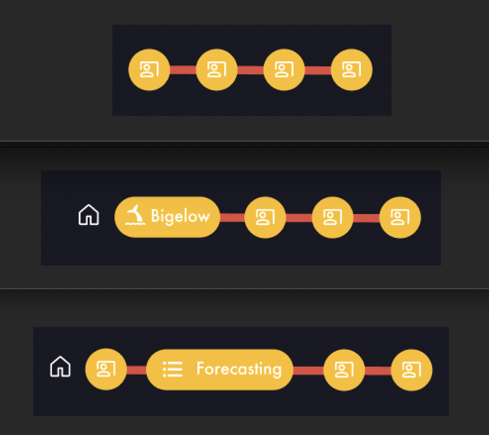

## ENGW 3315: Advanced Writing in the Disciplines

https://engw3315--playful-pika-d10517.netlify.app/

### Content Goals: 
- Add significant coding projects
- add sudoku game for funsies (?) 
- Add resume
- revise content to say "professional portfolio" rather than "advanced writing in the disciplines" where appropriate

### Design Goals:
- fix sizing on standard laptop
- My formatting is inconsistent at best. Fix that!
- revisit font choice, try to enhance readability
- Add light mode / dark mode toggle
- make home page background image scale better for smaller screens
- just in general have the site adapt well to smaller sizes
- make background image stop moving around on scroll
- swap out background image on some pages
- implement animated navigation tabs! The selected tab grows larger, deselected tabs are circles. 

### Code Goals:
- move repeated elements to components
- move lengthy paragraphs to "Text" files

